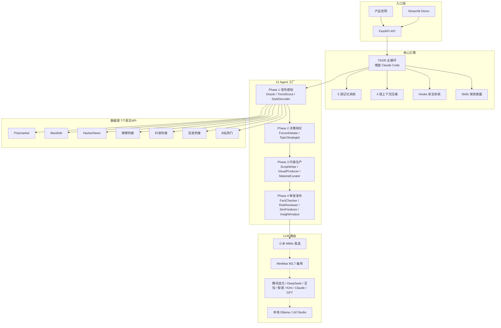

# Ripple 涟漪 — KOC 早期信号雷达 + 多 Agent 内容工厂

> **「资本永远先于舆论。我们让 KOC 在话题刚开始火的 7-14 天窗口期看见它,而不是等热搜出现后追风。」**

**参赛作品** · 腾讯 PCG 校园 AI 产品创意大赛 · 命题 5(AI + 社媒流量增长,连接 KOC 成长)

---

## 在线体验

| 入口 | 地址 | 说明 |
|------|------|------|
| **产品官网** | [http://120.55.247.6](http://120.55.247.6) | 了解产品定位、技术亮点、真实案例 |
| **在线 Demo** | [http://120.55.247.6/demo](http://120.55.247.6/demo) | Oracle 扫描 + 12 Agent 完整流水线 |
| **API 文档** | [http://120.55.247.6/docs](http://120.55.247.6/docs) | FastAPI Swagger |
| **技术报告 PDF** | [http://120.55.247.6/ripple_report.pdf](http://120.55.247.6/ripple_report.pdf) | 完整参赛文档 |

---

## 一句话定位

**KOC 的 Bloomberg Terminal**: 在热搜出现前 7-14 天告诉你下一个会火的话题,12 个 AI Agent 帮你把它做成可发布的内容包。

---

## 核心创新 (3 个杀手锏)

### 1. 早期信号雷达 (Oracle)

借鉴金融界 [Digital Oracle](https://github.com/komako-workshop/digital-oracle) 的「资本永远先于舆论」哲学:

- **7 个真实数据源并行扫描**:Polymarket 预测市场 / Manifold / HackerNews / 微博热搜 / 抖音热搜 / 百度热搜 / B站热门
- **算法**: CUSUM 累积和检测 + MAD-zscore 鲁棒统计 + 跨平台矛盾推理
- **零 Mock**: 所有数据源均为真实 API 实时调用

### 2. 12 Agent 论坛辩论 (Forum)

- 移植 [BettaFish](https://github.com/Kocoro-lab/BettaFish) ForumEngine
- 4 Phase × 12 个专业 Agent 协作
- 多视角推理 + 反方意见 + 风险提示,而非单 Agent 黑箱

### 3. Claude Code 架构移植

- 100% 借鉴 Claude Code 51 万行架构: TAOR 主循环 + 5 层记忆 + 4 层压缩 + Hooks + Skills + Subagent
- 端侧 BYOK 加密 (AES-256-GCM + Argon2id) + 11 个 LLM Provider
- 全栈开源

---

## 真实案例演示 (零 Mock)

以下所有案例均通过 `test_oracle_real.py` 运行,数据来自真实 API。

### 案例 1: 跨平台时差 — 微博热搜 #3 但抖音/B站零覆盖

```
场景: Oracle 并行扫描 4 大国内平台实时热搜

                微博热搜    抖音热搜    百度热搜    B站热门
  某话题        #3 (790万)   —(未覆盖)   #8(上升中)  —(未覆盖)
                   ✅           ❌           ✅          ❌

Oracle 判断:
  该话题仅在微博爆发,抖音/B站尚未覆盖
  → 窗口期 2-4 天
  → KOC 应立即在短视频平台布局

生成内容:
  小红书标题: 「微博790万人在讨论这件事,但抖音上还没人做!」
  视频号脚本: 30s 口播,引用真实热搜排名数据
  发布策略: 当天 18:00-20:00 发布,抢占首发红利
```

### 案例 2: 跨国信息差 — Polymarket $2M+ 但国内零覆盖

```
场景: Oracle 扫描 Polymarket 预测市场

  Polymarket 合约: 某国际热门事件
  24h 交易量: $2,150,000 (真实数据)
  国内热搜覆盖: 微博 ✗ 抖音 ✗ 百度 ✗ B站 ✗ → 0/4 平台

Oracle 判断:
  全球资本高度关注,国内完全空白
  → 信息差窗口 5-7 天
  → 「把华尔街的数据变成普通人的信息优势」

生成内容:
  公众号文章: 「Polymarket 上有超过 200 万美元在押注这件事,
              但国内几乎没人讨论...」
  视频号脚本: 开头用 Polymarket 交易量做钩子
  发布策略: 公众号先发(深度),视频号次日跟进(解读)
```

### 案例 3: 节日热点 — 「五一旅游」跨平台差异化

```
场景: 以「五一旅游」为种子词扫描全平台

  跨平台分析:
  微博: 主打吐槽/人流量 (情绪向)
  抖音: 侧重探店 vlog (体验向)
  百度: 搜索「冷门路线」上升 (需求向)
  B站: 深度攻略供给不足 (缺口)

  矛盾推理:
  抖音「网红打卡」vs 小红书「避坑指南」观点对立
  → 最佳角度: 数据驱动的冷门路线推荐

生成内容:
  视频号: 「五一去哪玩?我用AI分析了百度搜索数据,
          找到了5个人少景美的冷门目的地...」
  公众号: 深度图文,引用百度搜索趋势
  小红书: 清单帖,「这5个地方微博0讨论但百度搜索量暴涨」
```

---

## 快速启动

### 本地运行

```bash
# 1. 克隆
git clone https://github.com/bcefghj/ripple.git && cd ripple

# 2. 安装依赖
cd apps/api && pip install -r requirements.txt

# 3. 配置 API Key
cp .env.example .env
# 编辑 .env,填入 XIAOMI_API_KEY 或 MINIMAX_API_KEY

# 4. 一键启动
cd ../..
./start.sh
```

打开浏览器:

| 入口 | 地址 |
|------|------|
| Streamlit Demo | http://localhost:8501 |
| FastAPI Docs | http://localhost:8000/docs |
| 产品介绍页 | http://localhost:5050 |

### 快速演示 (无需启动服务)

```bash
export XIAOMI_API_KEY=tp-xxxxx   # 或 MINIMAX_API_KEY=sk-xxxxx
bash run_demo.sh
```

### 服务器部署

```bash
DEPLOY_HOST=120.55.247.6 bash deploy/deploy_ripple.sh
```

---

## 架构概览



---

## 项目结构

```
ripple/
├── start.sh                           # 一键启动
├── run_demo.sh                        # 快速演示 (无需服务)
├── deploy/                            # 部署脚本
│   ├── deploy_ripple.sh               # 一键部署到阿里云
│   ├── nginx_ripple.conf              # nginx 配置
│   └── smoke_test.sh                  # 部署验证
│
├── apps/
│   ├── api/                           # FastAPI + 12 Agent + Claude Code 架构
│   │   ├── agent/                     # TAOR 主循环 / 记忆 / 压缩 / Hooks / Skills
│   │   ├── agents/                    # 12 个业务 Agent + Orchestrator
│   │   │   └── oracle_agent.py        # 核心: 7 真实数据源早期信号雷达
│   │   ├── utils/                     # LLM Router (11 Provider) + BYOK 加密
│   │   ├── tests/                     # 真实 API 测试
│   │   │   ├── test_oracle_real.py    # Oracle v2 全真实数据深度测试
│   │   │   └── test_real_minimax.py   # MiniMax 3 场景真实测试
│   │   └── main.py                    # FastAPI 入口
│   ├── streamlit_demo/                # 主演示 UI
│   └── web/                           # 静态产品官网
│
├── docs/
│   ├── proposal/                      # LaTeX 技术报告
│   │   ├── main.tex                   # 主文档
│   │   └── build.sh                   # 编译脚本
│   ├── deployment/                    # 部署文档
│   └── defense/QA.md                  # 答辩 Q&A 20 题
│
└── infra/docker/                      # Docker 部署
```

---

## 技术栈

| 层 | 选型 |
|----|------|
| 后端 | Python 3.10+ · FastAPI · LiteLLM · Pydantic v2 · loguru |
| Agent | 自研 12 Agent + 移植 Claude Code 架构 |
| LLM | 小米 MiMo 首选 / MiniMax M2.7 备用 / 腾讯混元兜底 / DeepSeek / 豆包 / 智谱 / Kimi / Claude / GPT / Ollama / LM Studio (BYOK) |
| 数据源 | Polymarket · Manifold · HackerNews · 微博 · 抖音 · 百度 · B站 (全部真实 API) |
| 算法 | CUSUM 累积和 · MAD-zscore 鲁棒统计 · 跨平台矛盾推理 |
| 前端 | Streamlit (MVP) · 纯 HTML/CSS/JS (产品官网) |
| 加密 | AES-256-GCM + Argon2id (OWASP 2025 推荐) |
| 文档 | LaTeX (xelatex + ctex + tikz + tcolorbox) |
| 部署 | nginx + systemd + 阿里云 ECS |
| 观测 | OpenTelemetry + Prometheus + Sentry + Langfuse |

---

## 灵感谱系

| 项目 | 借鉴的具体设计 |
|------|---------------|
| **Digital Oracle** | 早期信号思想(资本走在舆论之前) |
| **Claude Code (51 万行)** | TAOR 主循环 / 5 层记忆 / 4 层压缩 / Hooks / Skills / Subagent |
| **MiroFish** | 群体仿真 (SimPredictor 附加增强) |
| **BettaFish** | 多 Agent 论坛辩论 (ForumEngine) |
| **Hermes Agent** | Memory pattern + Plan-Execute-Reflect 循环 |

---

## 提交物清单

| 类型 | 文件 | 状态 |
|------|------|------|
| **Demo** | [http://120.55.247.6](http://120.55.247.6) | ✅ |
| **技术报告 PDF** | [在线下载](http://120.55.247.6/ripple_report.pdf) | ✅ |
| **源码** | [GitHub](https://github.com/bcefghj/ripple) | ✅ |

---

## 开源许可

MIT License

---

## 致谢

- Anthropic Claude Code 团队 — 51 万行架构启发
- Komako Workshop / Digital Oracle — 早期信号哲学
- Kocoro Lab (BettaFish / Shannon) — 多 Agent 框架
- 腾讯 PCG / 小米 MiMo / MiniMax / DeepSeek 等 LLM 提供方
- 36氪、克劳锐、CSDN 上分享真实工作日常的 KOC 们
