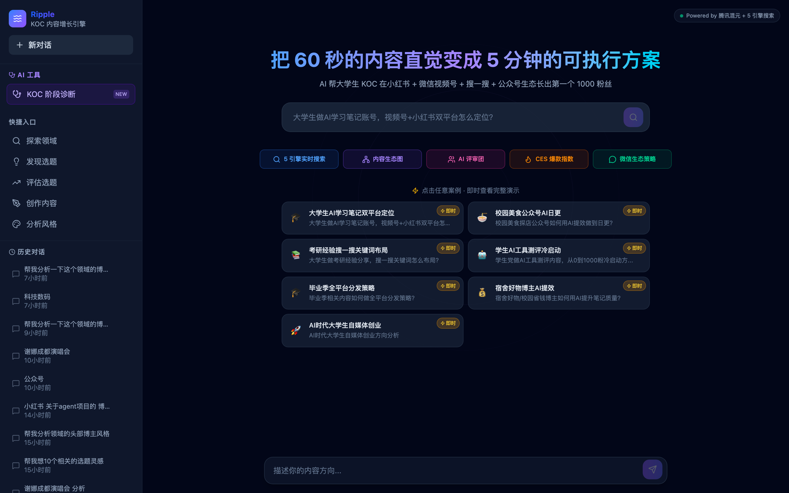
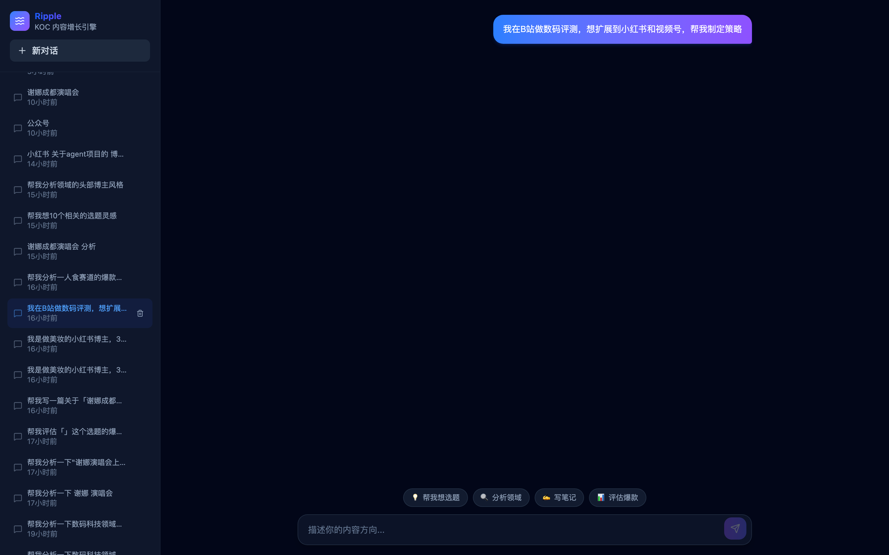

# 🌊 Ripple

> **把 60 秒的内容直觉，变成 5 分钟的可执行方案。**
> AI 帮大学生 KOC 在小红书 + 微信视频号 + 搜一搜 + 公众号生态长出第一个 1000 粉丝。

<p align="center">
  
  
  
  
  
  
</p>

<p align="center">
  <a href="http://120.55.247.6/app/"><strong>🚀 在线体验 Demo</strong></a> ·
  <a href="http://120.55.247.6/"><strong>🌐 产品介绍页</strong></a> ·
  <a href="pdf/ripple_report_v4.pdf"><strong>📄 技术报告 PDF</strong></a>
</p>

---

## 👤 作者信息

| 项目 | 信息 |
|------|------|
| **作者** | 戴尚好 |
| **GitHub** | [@bcefghj](https://github.com/bcefghj) |
| **小红书** | @bcefghj |
| **参赛项目** | 腾讯PCG校园AI产品创意大赛 · 赛道5（内容创作工具） |
| **在线 Demo** | http://120.55.247.6/app/ |
| **产品官网** | http://120.55.247.6/ |

---

## 🎯 5 秒看懂 Ripple

| 你的困境 | Ripple 的解决方案 |
|---------|-----------------|
| 我想做 KOC，但不知道做什么内容 | 输入领域，**5 秒**看完 6 个深度演示 |
| 不知道选题能不能爆 | **CES 爆款指数模拟器**，9 维度评分 + 30 天增长曲线投影 |
| 想了解微信生态算法但学不动 | 视频号社交链路图 / 搜一搜热度图 / 公众号 SEO 矩阵 / 私域 KOC 金字塔，**4 个交互面板**直接秒懂 |
| AI 推荐选题不可信 | **7 位 AI 专家圆桌辩论** + 共识度环形进度，每条建议都有正反双方观点 |
| 内容写完了不知道怎么发 | **一键复制三种格式**：原文 / 小红书 / 视频号脚本 / 公众号 |

---

## 🆚 与同类工具的差异

| AI 原生能力 | ChatGPT | Perplexity | **Ripple** |
|------------|---------|-----------|----------|
| 多源实时搜索 + 来源引用 | ⚠️ | ✅ | ✅ |
| **7 位 AI 专家圆桌辩论 + 共识度** | ❌ | ❌ | **✅** |
| **CES 爆款指数模拟器（小红书算法）** | ❌ | ❌ | **✅** |
| **KOC 4 阶段诊断 + 专属下一步** | ❌ | ❌ | **✅** |
| **视频号社交链路 / 搜一搜热度可视化** | ❌ | ❌ | **✅** |
| **内容生态图谱（KOC 涨粉视角）** | ❌ | ❌ | **✅** |
| **微信生态深度集成（4 大子生态）** | ❌ | ❌ | **✅** |
| **多平台一键内容格式转换** | ❌ | ❌ | **✅** |

---

## 📸 产品截图

<table>
  <tr>
    <td width="50%"><b>🏠 5 秒法则首屏</b><br/></td>
    <td width="50%"><b>🌐 内容生态图（中文原生）</b><br/></td>
  </tr>
  <tr>
    <td width="50%"><b>🎤 AI 评审团 7 人圆桌</b><br/></td>
    <td width="50%"><b>📊 CES 爆款指数模拟器</b><br/></td>
  </tr>
  <tr>
    <td width="50%"><b>🔍 搜一搜关键词热度</b><br/></td>
    <td width="50%"><b>🏆 KOC 阶段诊断</b><br/></td>
  </tr>
  <tr>
    <td width="50%"><b>📋 Demo 案例展示</b><br/></td>
    <td width="50%"><b>📤 一键复制多格式导出</b><br/></td>
  </tr>
</table>

---

## 🏗️ 技术架构

```
┌──────────────────────────────────────────────────────────────────────┐
│              Frontend (React 19 + TypeScript + Vite + Tailwind v4)   │
│  ┌─────────────────────────────────────────────────────────────────┐ │
│  │ Hero (5秒法则) · ChatMessage · 内容生态图 · AI 评审团圆桌      │ │
│  │ 爆款指数仪表盘(CES模拟器) · 微信生态四面板 · 一键复制          │ │
│  └─────────────────────────────────────────────────────────────────┘ │
├──────────────────────────────────────────────────────────────────────┤
│                         SSE Streaming API                             │
├──────────────────────────────────────────────────────────────────────┤
│              Backend (FastAPI + Async + SQLite Memory)                │
│  ┌─────────────────────────────────────────────────────────────────┐ │
│  │           5 引擎实时搜索矩阵                                     │ │
│  │ MiniMax · Serper(Google) · Tavily · DuckDuckGo · DailyHot      │ │
│  └─────────────────────────────────────────────────────────────────┘ │
│  ┌──────────────────────┬──────────────────────────────────────────┐ │
│  │ 内容生态图谱          │  7 位 AI 专家圆桌辩论引擎               │ │
│  │ (single-pass 60 节点) │  (数据/内容/心理/平台/风险/研究/用户)   │ │
│  └──────────────────────┴──────────────────────────────────────────┘ │
│  ┌──────────────────────┬──────────────────────────────────────────┐ │
│  │ 微信生态策略生成      │  CES 爆款指数（小红书算法模拟）          │ │
│  │ (视频号/搜一搜/        │  9 维度评分 + 流量池预测 + 增长投影     │ │
│  │  公众号/私域)          │  CES = 关注×8+评论×4+转发×4+...         │ │
│  └──────────────────────┴──────────────────────────────────────────┘ │
└──────────────────────────────────────────────────────────────────────┘
```

---

## 🚀 快速启动（本地开发）

### 前置要求

- Python >= 3.10
- Node.js >= 18
- npm >= 8

### 第一步：克隆项目

```bash
git clone https://github.com/bcefghj/ripple.git
cd ripple/ripple3
```

### 第二步：配置环境变量

```bash
cp .env.example .env
```

用文本编辑器打开 `.env`，至少填入以下一项 API Key：

```ini
# 必选（二选一，推荐 MiniMax，有免费额度）
MINIMAX_API_KEY=sk-xxxxxx          # 注册: https://www.minimax.io
XIAOMI_API_KEY=tp-xxxxxx           # 小米 MiMo 模型

# 可选（搜索增强，均有免费额度）
SERPER_API_KEY=                    # Google 搜索, 2500次/月免费
TAVILY_API_KEY=                    # AI 搜索, 1000次/月免费
HUNYUAN_API_KEY=                   # 腾讯混元（比赛加分项）
```

> **不想配 API Key？** 直接启动后点击首页 6 个 Demo 案例，零延迟展示完整产品流。

### 第三步：启动后端

```bash
# 安装 Python 依赖
pip install -r requirements.txt

# 启动 API 服务（默认端口 8001）
python -m uvicorn api.main:app --reload --port 8001
```

### 第四步：启动前端

```bash
cd web
npm install
npm run dev
```

打开 [http://localhost:5173](http://localhost:5173) 即可体验。

---

## 🐳 Docker 部署

```bash
# 构建镜像
docker build -t ripple .

# 运行容器（需要提前准备 .env 文件）
docker run -p 8000:8000 --env-file ripple3/.env ripple
```

或使用 `docker-compose`：

```yaml
# docker-compose.yml
version: '3.8'
services:
  ripple:
    build: .
    ports:
      - "8000:8000"
    env_file:
      - ripple3/.env
    volumes:
      - ./ripple3/ripple.db:/app/ripple.db
    restart: unless-stopped
    healthcheck:
      test: ["CMD", "curl", "-f", "http://localhost:8000/api/health"]
      interval: 30s
      timeout: 10s
      retries: 3
```

```bash
docker-compose up -d
```

---

## ☁️ 服务器部署（阿里云 / 腾讯云 ECS）

### 服务器要求

| 配置 | 最低 | 推荐 |
|------|------|------|
| CPU | 2 核 | 4 核 |
| 内存 | 4 GB | 8 GB（多 Agent 并行需要）|
| 带宽 | 3 Mbps | 5 Mbps+ |
| 系统 | Ubuntu 22.04 | Ubuntu 22.04 |

### 部署步骤

```bash
# 1. 拉取代码
cd /opt
git clone https://github.com/bcefghj/ripple.git
cd ripple/ripple3

# 2. 配置环境变量
cp .env.example .env
vim .env   # 填入 API Keys

# 3. 安装 Python 依赖
pip3 install -r requirements.txt

# 4. 构建前端
cd web && npm ci && npm run build && cd ..

# 5. 配置 systemd 服务
sudo tee /etc/systemd/system/ripple.service > /dev/null <<EOF
[Unit]
Description=Ripple API Server
After=network.target

[Service]
Type=exec
User=www-data
WorkingDirectory=/opt/ripple/ripple3
ExecStart=/usr/bin/python3 -m uvicorn api.main:app --host 127.0.0.1 --port 8001
Restart=always
RestartSec=5
EnvironmentFile=/opt/ripple/ripple3/.env

[Install]
WantedBy=multi-user.target
EOF

sudo systemctl daemon-reload
sudo systemctl enable ripple
sudo systemctl start ripple

# 6. 配置 Nginx 反向代理
sudo tee /etc/nginx/sites-available/ripple > /dev/null <<'EOF'
server {
    listen 80;
    server_name your-domain-or-ip;

    # 前端静态文件
    location /app/ {
        alias /opt/ripple/ripple3/web/dist/;
        try_files $uri $uri/ /app/index.html;
    }

    # 后端 API（SSE 需要关闭 buffering）
    location /api/ {
        proxy_pass http://127.0.0.1:8001;
        proxy_http_version 1.1;
        proxy_set_header Connection '';
        proxy_set_header X-Forwarded-For $proxy_add_x_forwarded_for;
        proxy_buffering off;
        proxy_cache off;
        chunked_transfer_encoding on;
        proxy_read_timeout 300s;
    }

    # 落地页
    location / {
        root /opt/ripple/website/ripple-site;
        try_files $uri $uri/ /index.html;
    }
}
EOF

sudo ln -sf /etc/nginx/sites-available/ripple /etc/nginx/sites-enabled/
sudo nginx -t && sudo systemctl reload nginx
```

### 更新部署

```bash
cd /opt/ripple
git pull
cd ripple3/web && npm ci && npm run build && cd ..
sudo systemctl restart ripple
```

---

## 🔑 API Key 配置说明

| 变量名 | 必需 | 获取地址 | 免费额度 |
|--------|------|---------|---------|
| `MINIMAX_API_KEY` | ✅ 推荐 | [minimax.io](https://www.minimax.io) | 有免费额度 |
| `XIAOMI_API_KEY` | ✅ 推荐 | 小米 MiMo 平台 | 有免费额度 |
| `HUNYUAN_API_KEY` | 推荐 | [cloud.tencent.com](https://cloud.tencent.com) | 10万 tokens/月 |
| `SERPER_API_KEY` | 可选 | [serper.dev](https://serper.dev) | 2500次/月 |
| `TAVILY_API_KEY` | 可选 | [tavily.com](https://tavily.com) | 1000次/月 |
| `EXA_API_KEY` | 可选 | [exa.ai](https://exa.ai) | $10 免费额度 |
| `JINA_API_KEY` | 可选 | [jina.ai](https://jina.ai) | 10M tokens/月 |

> 最低配置只需填写 `MINIMAX_API_KEY` 或 `XIAOMI_API_KEY` 其中一个即可运行全部功能。

---

## 📋 6 个内置 Demo 案例

无需配置 API Key，直接点击即可体验完整 AI 流程：

| Demo | 赛道 | 核心看点 |
|------|------|---------|
| 🎓 大学生 AI 学习笔记双平台定位 | 教育 | 双平台差异化策略 / 双高峰流量窗口 |
| 🍜 校园美食探店日更 | 本地化 | AI 提效全链路 / 本地 SEO 布局 |
| 📚 考研经验关键词布局 | 教育 | 搜一搜三级关键词体系 |
| 🤖 学生 AI 工具测评冷启动 | AI | 0→1000 粉冷启动方法论 |
| 🎓 毕业季全平台分发 | 情感 | 视频号社交链路放大效应 |
| 💰 宿舍好物 AI 提效 | 消费 | CPS 商业化 / AI 比价 |

---

## 📂 项目结构

```
ripple3/
├── api/                           # FastAPI 后端
│   ├── main.py                    # 应用入口
│   ├── routes.py                  # 主路由（chat / health / conversations）
│   └── sse.py                     # SSE 事件构造器
├── core/                          # 核心模块
│   ├── config.py                  # 配置加载（读取 .env）
│   ├── llm.py                     # LLM 调用封装
│   ├── intent.py                  # 意图识别
│   ├── store.py                   # SQLite 存储
│   └── citations.py               # 引文处理
├── adapters/                      # 20 个搜索引擎适配器
│   ├── minimax_search.py          # MiniMax 联网搜索
│   ├── serper_adapter.py          # Google SERP
│   ├── tavily_adapter.py          # Tavily AI 搜索
│   ├── ddgs_adapter.py            # DuckDuckGo（免费）
│   ├── dailyhot_adapter.py        # 中国热搜聚合
│   └── ...                        # 更多适配器
├── engines/                       # AI 引擎
│   ├── graph_builder.py           # 内容生态图（single-pass 60 节点）
│   ├── multi_agent.py             # 7 位 AI 专家圆桌引擎
│   ├── viral_scorer.py            # CES 爆款指数（多平台算法）
│   ├── content_dna.py             # 内容基因分析
│   └── title_ab_test.py           # 标题 A/B 测试
├── .env.example                   # 环境变量模板
├── requirements.txt               # Python 依赖
└── web/                           # React 前端
    └── src/
        ├── components/            # 30+ React 组件
        │   ├── HeroWelcome.tsx    # 5 秒法则首屏
        │   ├── ChatMessage.tsx    # 消息渲染
        │   ├── KnowledgeGraph3D.tsx  # 内容生态图
        │   ├── AgentRoundtable.tsx   # 7 位 AI 评审团圆桌
        │   ├── ViralScoreDashboard.tsx # CES 爆款指数仪表盘
        │   ├── KOCStageDiagnose.tsx  # KOC 4 阶段诊断
        │   ├── WeChatEcosystemPanel.tsx # 微信生态四面板
        │   └── CopyButton.tsx     # 多格式一键复制
        ├── data/demoCases.ts      # 6 个 Demo 案例（含完整 mock 数据）
        ├── hooks/useChat.ts       # SSE 状态管理
        └── lib/api.ts             # API 类型 + 客户端

website/
└── ripple-site/                   # 产品落地页（纯静态）
    ├── index.html
    ├── app.js
    └── style.css

pdf/
├── ripple_report_v4.pdf           # 技术报告（50+ 页）
└── screenshots/                   # 产品截图
```

---

## 🔑 关键技术决策

### 1. 内容生态图（为什么不叫"知识图谱"）

原版使用 `react-force-graph-2d` + Two-Pass LLM 提取 250 节点，导致 80% 节点是 LLM 编造的，视觉混乱。

**改进方案：**
- 改为 single-pass 60 节点，质量优先于数量
- Canvas 字体改为 `PingFang SC, Microsoft YaHei` 中文优先（解决中英混排变形）
- 重命名"知识图谱"→"内容生态图"，更贴近用户语言

### 2. 各平台算法公式正确归属

| 平台 | 算法公式 |
|------|---------|
| **小红书** | CES = 关注×8 + 评论×4 + 转发×4 + 收藏×1 + 点赞×1 |
| **视频号** | 推荐分 = 社交关系链×60% + 完播率×25% + 互动深度×15% |
| **公众号** | 推荐分 = 打开率×50% + 在看率×30% + 转发率×20% |
| **抖音** | 推荐分 = 完播率×40% + 互动率×30% + 关注转化×30% |

### 3. AI 评审团前后端完整联通

后端 SSE 流发送 `agent_speak / arbiter_thinking / score` 三种事件，前端 `AgentRoundtable.tsx` 完整渲染：
- 环形 7 头像布局，点击查看单人发言
- 自动识别态度（看好/中立/谨慎）+ 共识度环形进度条
- 仲裁者卡片：金色边框 + 综合评分 + 风险/行动三栏

---

## 🐛 常见问题排查

| 问题 | 原因 | 解决方法 |
|------|------|---------|
| 搜索结果为空 | API Key 未配置或错误 | 检查 `.env` 中的 `MINIMAX_API_KEY` |
| 内容生态图不显示 | 意图未识别为 `radar` | 查看后端日志中的 `intent:` 输出 |
| 前端白屏 | `web/dist/` 不存在 | 运行 `cd web && npm run build` |
| SSE 断连 | Nginx 缓冲未关闭 | 确认 `proxy_buffering off` 配置 |
| 中文字体乱码 | Canvas 字体未加载 | 确保运行环境安装了中文字体 |

---

## 📄 技术报告

完整技术报告（50+ 页）涵盖产品设计、技术架构、算法实现、商业模式分析：

👉 [ripple_report_v4.pdf](pdf/ripple_report_v4.pdf)

---

## 📝 License

MIT — 本项目为腾讯PCG校园AI产品创意大赛参赛作品，代码开源可自由使用。

---

## 📞 联系

- 提交 Issue：[github.com/bcefghj/ripple/issues](https://github.com/bcefghj/ripple/issues)
- **作者**：戴尚好 | GitHub: [@bcefghj](https://github.com/bcefghj)
