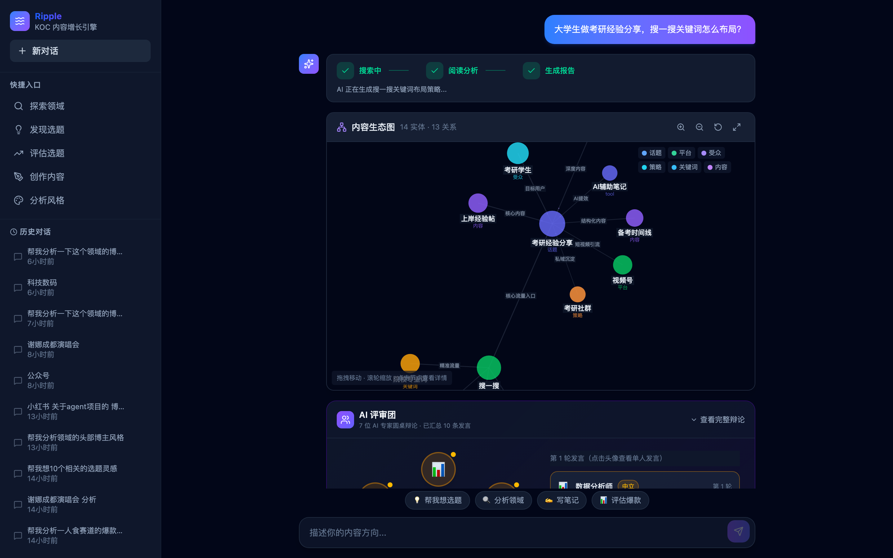
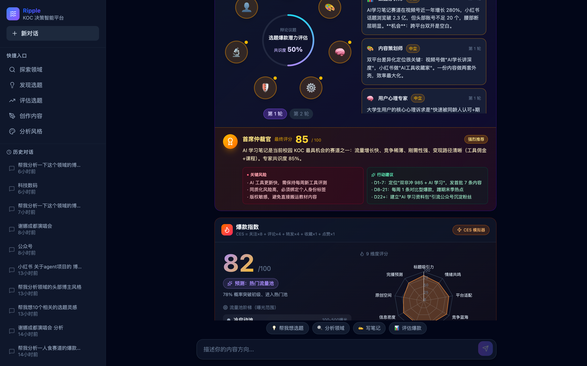
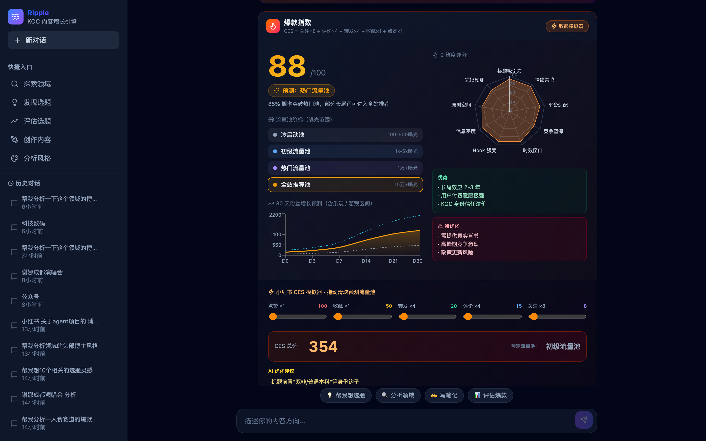
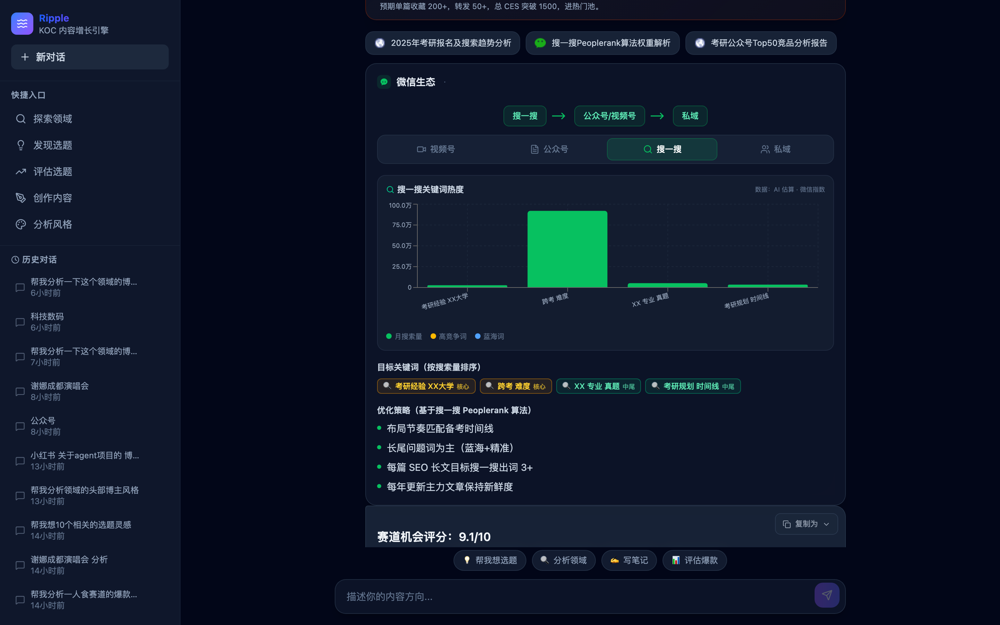
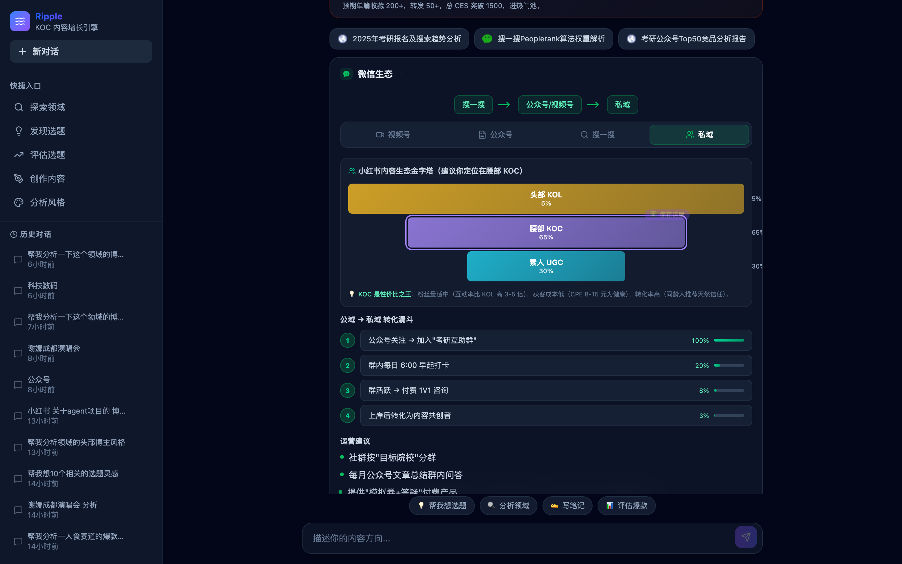
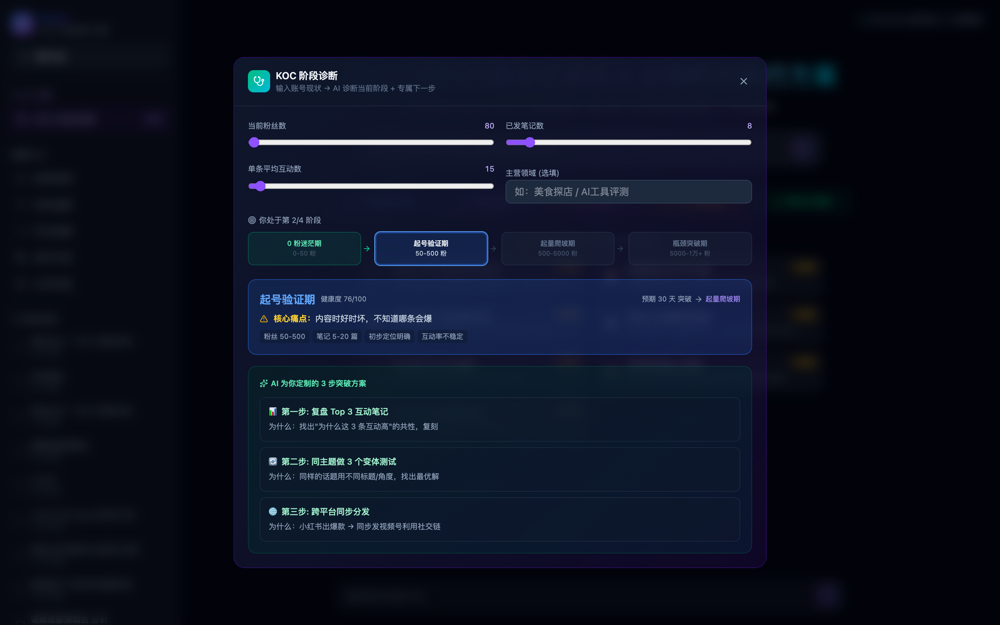

# 🌊 Ripple

> **把 60 秒的内容直觉，变成 5 分钟的可执行方案。**
> AI 帮大学生 KOC 在小红书 + 微信视频号 + 搜一搜 + 公众号生态长出第一个 1000 粉丝。

<p align="center">
  
  
  
  
  
  
</p>

---

## 5 秒看懂 Ripple

| 你 | Ripple |
|---|---|
| 我想做 KOC，但不知道做什么内容 | 输入领域，**5 秒** 看完 6 个深度演示 |
| 不知道选题能不能爆 | **CES 爆款指数模拟器**，9 维度评分 + 30 天增长曲线投影 |
| 想了解微信生态算法但学不动 | 视频号社交链路图 / 搜一搜热度图 / 公众号 SEO 矩阵 / 私域 KOC 金字塔，**4 个交互面板**直接秒懂 |
| AI 推荐选题不可信 | **7 位 AI 专家圆桌辩论** + 共识度环形进度，每条建议都有正反双方观点 |
| 内容写完了不知道怎么发 | **一键复制三种格式**：原文 / 小红书 / 视频号脚本 / 公众号 |

---

## 🎯 凭什么是 Ripple（6 个 AI 原生不可替代能力）

| AI 原生能力 | ChatGPT | Perplexity | Ripple |
|------------|---------|-----------|--------|
| 多源实时搜索 + 来源引用 | ⚠️ | ✅ | ✅ |
| **7 位 AI 专家圆桌辩论 + 共识度** | ❌ | ❌ | **✅** |
| **CES 爆款指数模拟器（小红书算法）** | ❌ | ❌ | **✅** |
| **KOC 4 阶段诊断 + 专属下一步** | ❌ | ❌ | **✅** |
| **视频号社交链路 / 搜一搜热度可视化** | ❌ | ❌ | **✅** |
| **内容生态图谱（KOC 涨粉视角）** | ❌ | ❌ | **✅** |
| **微信生态深度集成（4 大子生态）** | ❌ | ❌ | **✅** |
| **多平台一键内容格式转换** | ❌ | ❌ | **✅** |

> 与通用 AI 的核心差异：**赛道纵深**——Ripple 不是"会回答 KOC 问题的 AI"，而是"用算法和可视化让 KOC 能直接行动的产品"。

### 📸 视觉证据（实际渲染截图）

<table>
  <tr>
    <td width="33%"><b>5 秒法则首屏</b><br/></td>
    <td width="33%"><b>内容生态图（中文原生）</b><br/></td>
    <td width="33%"><b>AI 评审团圆桌</b><br/></td>
  </tr>
  <tr>
    <td width="33%"><b>CES 模拟器</b><br/></td>
    <td width="33%"><b>搜一搜关键词热度</b><br/></td>
    <td width="33%"><b>KOC 金字塔</b><br/></td>
  </tr>
  <tr>
    <td colspan="3"><b>KOC 阶段诊断 — 4 阶段 + 专属下一步</b><br/></td>
  </tr>
</table>

---

## 🏗️ 技术架构

```
┌──────────────────────────────────────────────────────────────────────┐
│              Frontend (React 19 + TypeScript + Vite + Tailwind v4)   │
│  ┌─────────────────────────────────────────────────────────────────┐ │
│  │ Hero (5秒法则) · ChatMessage · 内容生态图 · AI 评审团圆桌     │ │
│  │ 爆款指数仪表盘(CES模拟器) · 微信生态四面板 · 一键复制         │ │
│  └─────────────────────────────────────────────────────────────────┘ │
├──────────────────────────────────────────────────────────────────────┤
│                         SSE Streaming API                              │
├──────────────────────────────────────────────────────────────────────┤
│              Backend (FastAPI + Async + SQLite Memory)                │
│  ┌─────────────────────────────────────────────────────────────────┐ │
│  │           5 引擎实时搜索矩阵                                     │ │
│  │ MiniMax · Serper(Google) · Tavily · DuckDuckGo · DailyHot      │ │
│  └─────────────────────────────────────────────────────────────────┘ │
│  ┌──────────────────────┬─────────────────────────────────────────┐ │
│  │ 内容生态图谱          │  7 位 AI 专家圆桌辩论引擎              │ │
│  │ (single-pass 60 节点) │  (📊 数据 / 🎨 内容 / 🧠 心理 /         │ │
│  │ 中文原生 · 高质量     │   ⚙️ 平台 / 🛡️ 风险 / 🔬 研究 / 👤 用户) │ │
│  └──────────────────────┴─────────────────────────────────────────┘ │
│  ┌──────────────────────┬─────────────────────────────────────────┐ │
│  │ 微信生态策略生成      │  CES 爆款指数（小红书算法模拟）         │ │
│  │ (视频号/搜一搜/       │  9 维度评分 + 流量池预测 + 增长投影     │ │
│  │  公众号/私域)         │  CES = 关注×8 + 评论×4 + 转发×4 + ...   │ │
│  └──────────────────────┴─────────────────────────────────────────┘ │
└──────────────────────────────────────────────────────────────────────┘
```

---

## 🚀 一键启动

### 后端

```bash
cd ripple3
cp .env.example .env       # 填入 API Keys（混元/MiniMax/Serper 任选）
pip install -r requirements.txt
python -m uvicorn api.main:app --reload --port 8001
```

### 前端

```bash
cd ripple3/web
npm install
npm run dev
```

打开 [http://localhost:5173](http://localhost:5173) 即可。

> **不想配 API Key？** 直接点击首页 6 个 Demo 案例，**零延迟**展示完整产品流（已预制完整数据）。

---

## 📋 6 个 Demo 案例（即时演示）

| Demo | 赛道 | 卖点 |
|------|------|------|
| 🎓 大学生 AI 学习笔记双平台定位 | 教育 | 双平台差异化 / 双高峰流量 |
| 🍜 校园美食探店日更 | 本地化 | AI 提效全链路 / 本地 SEO |
| 📚 考研经验关键词布局 | 教育 | 搜一搜三级关键词体系 |
| 🤖 学生 AI 工具测评冷启动 | AI | 0→1000 粉冷启动方法论 |
| 🎓 毕业季全平台分发 | 情感 | 视频号社交链路放大 |
| 💰 宿舍好物 AI 提效 | 消费 | CPS 商业化 / AI 比价 |

---

## 🎯 赛题 5 评分维度对齐

| 评分维度 | Ripple 的解决方案 | 关键交付 |
|---------|------------------|---------|
| **赛道适配性** | 6 demo 全部围绕"KOC 涨粉"主题，4 个微信生态子面板各有真实策略 | [demoCases.ts](ripple3/web/src/data/demoCases.ts) / [WeChatEcosystemPanel](ripple3/web/src/components/WeChatEcosystemPanel.tsx) |
| **作品完整性** | 选题→分析→评审→预测→创作→发布→导出全闭环 + 三种格式一键复制 | [CopyButton](ripple3/web/src/components/CopyButton.tsx) |
| **创新性** | 7 位 AI 专家圆桌（共识度环 + 仲裁卡） + CES 模拟器（5 滑块实时算分） | [AgentRoundtable](ripple3/web/src/components/AgentRoundtable.tsx) / [ViralScoreDashboard](ripple3/web/src/components/ViralScoreDashboard.tsx) |
| **用户洞察** | 精准对应"不知道做什么内容"的 KOC 痛点，6 demo 均为真实大学生场景 | 内容生态图（"知识图谱"已重命名为更亲切的"内容生态图"） |
| **AI 原生性** | 全程 AI 透明可见：搜索→图谱→7 Agent 讨论→CES 评分→报告，5 个独家 AI 能力 | 整个 [api/routes.py](ripple3/api/routes.py) 流式管道 |
| **落地可行性** | 可部署到 Vercel/Railway，使用免费/低成本 API（MiniMax 有免费额度） | [SUBMISSION.md](SUBMISSION.md) |
| **商业化能力** | 订阅 + KOC 商家撮合 + 私有化部署，详见 [docs/proposal/main.pdf](ripple3/docs/proposal/) | 完整商业模式分析 |

---

## 📂 项目结构

```
ripple3/
├── api/                              # FastAPI 路由 + SSE 流式
│   ├── routes.py                     # 主路由（chat / health / conversations / graph_expand）
│   ├── pipelines/                    # 业务流水线（待迁移）
│   ├── sse.py                        # SSE 事件构造器
│   └── main.py                       # 应用入口
├── core/                             # 核心：LLM / 意图 / 存储 / 引文
├── adapters/                         # 18 个搜索引擎适配器
├── engines/                          # AI 引擎
│   ├── graph_builder.py              # 内容生态图（single-pass 60 节点）
│   ├── multi_agent.py                # 7 位 AI 专家圆桌引擎
│   ├── viral_scorer.py               # CES 爆款指数（多平台公式）
│   ├── content_dna.py                # 内容基因分析
│   └── title_ab_test.py              # 标题 A/B 测试
└── web/
    └── src/
        ├── components/               # 30+ React 组件
        │   ├── HeroWelcome.tsx       # 5 秒法则首屏 + Ripple 波纹动画
        │   ├── ChatMessage.tsx       # 消息渲染主体
        │   ├── KnowledgeGraph3D.tsx  # 内容生态图（中文优化版）
        │   ├── AgentRoundtable.tsx   # 🆕 7 位 AI 评审团圆桌
        │   ├── ViralScoreDashboard.tsx # 🆕 CES 爆款指数仪表盘
        │   ├── KOCStageDiagnose.tsx  # 🆕 KOC 4 阶段诊断
        │   ├── WeChatEcosystemPanel.tsx # 微信生态四面板（已深度强化）
        │   └── CopyButton.tsx        # 🆕 三种格式一键复制
        ├── data/demoCases.ts         # 6 个 Demo 案例（含完整 mock 数据）
        ├── hooks/useChat.ts          # SSE 状态管理
        └── lib/api.ts                # API 类型 + 客户端
```

---

## 🔑 几个关键技术决策

### 1. 内容生态图（不叫"知识图谱"）

**问题**：原版用 `react-force-graph-2d` + Two-Pass LLM 提取 250 节点，导致 80% 节点是 LLM 编造的，视觉混乱。

**解决**：
- 改为 single-pass 60 节点，质量 > 数量
- Canvas 字体改为 `PingFang SC, Microsoft YaHei` 中文优先（解决中英混排变形）
- 重命名"知识图谱"→"内容生态图"，去技术化产品语言

### 2. 平台算法公式正确归属

**问题**：CES 公式（关注×8+评论×4+...）是**小红书**算法，不是视频号的。

**解决**：[engines/viral_scorer.py](ripple3/engines/viral_scorer.py) 按平台分发不同公式：

| 平台 | 公式 |
|------|------|
| 小红书 | CES = 关注×8 + 评论×4 + 转发×4 + 收藏×1 + 点赞×1 |
| 视频号 | 推荐分 = 社交关系链×60% + 完播率×25% + 互动深度×15% |
| 公众号 | 推荐分 = 打开率×50% + 在看率×30% + 转发率×20% |
| 抖音 | 推荐分 = 完播率×40% + 互动率×30% + 关注转化×30% |

### 3. AI 评审团（多 Agent 已收集，但原版前端未渲染）

**问题**：后端 SSE 流已发送 `agent_speak / arbiter_thinking / score` 三种事件，前端 useChat 已收集到 state，但 ChatMessage.tsx 完全没渲染——这是创新性最大的"白做"。

**解决**：新建 [AgentRoundtable.tsx](ripple3/web/src/components/AgentRoundtable.tsx)：
- 环形 7 头像 + 点击查看单人发言
- 自动检测态度（看好/中立/谨慎）+ 共识度环形进度
- 仲裁者卡片：金色边框 + 评分 + 风险/行动三栏

---

## 📝 License

MIT — 本项目原创，可自由使用。

---

## 📞 联系

提交问题或建议请打开 issue。  
**作者**：Ripple 团队
